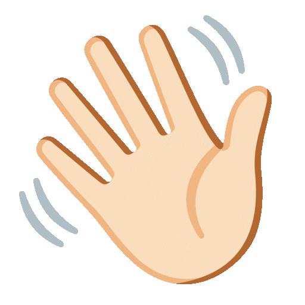

  

  

##  About Me

<ul type="none">
  <li>💼 I'm awaiting Job Training at CISSL Philippine Branch</li>
  <li>💬 Talk to me about software development and pure mathematics</li>
  <li>👯 I’m looking to collaborate on software dev projects</li>
  <li>📫 Contact me at <a href="mailto:aquino.ylt@gmail.com">aquino.ylt@gmail.com</a></li>
  <li>🌐 <b>Check out my personal site <a target="_blank" rel="noopener noreferrer" href="https://yvanlowellaquino.vercel.app/">here</a></b></li>
  <li>☕ Buy me a coffee <a href="https://buymeacoffee.com/yvanlowellaquino">here</a></li>
  <li>☁ Take a look at <a href="https://www.awsreviewer.site/">this</a></li>
</ul>

##  Skills

  
  
  
  
  
   
  
  
  
  
  
   
  
  
  

##  Project Preview

  

